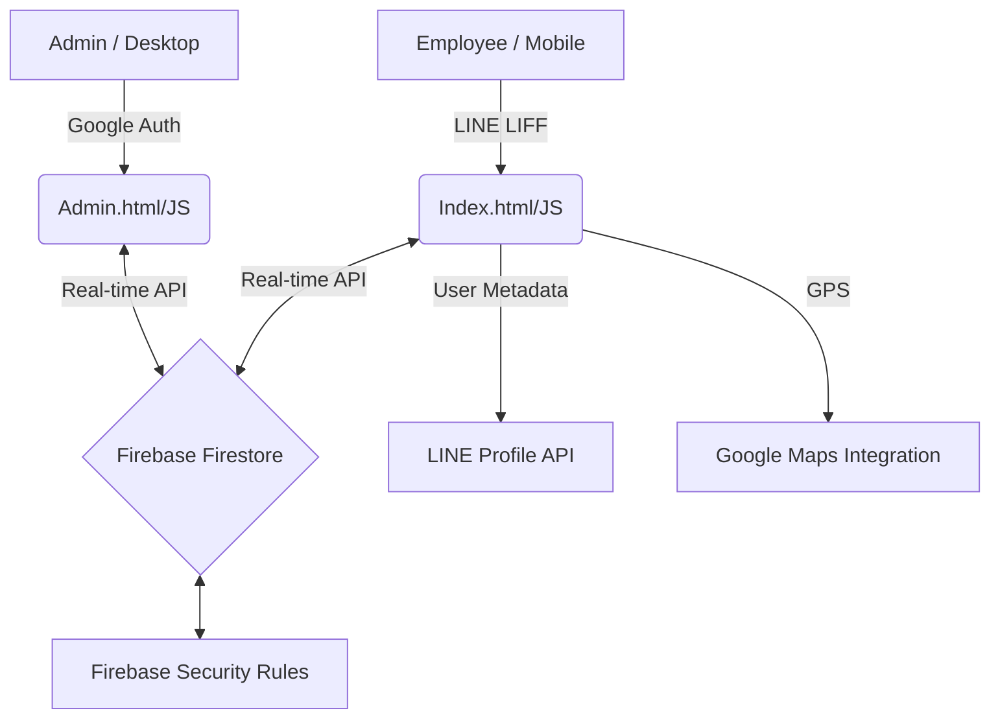

# 🏗️ System Overview - MLP Time Attendance Dashboard

Detailed technical architecture and system design for the MLP Time Attendance system (v3.15).

## 🧩 System Architecture
The application follows a **Serverless / Event-driven** architecture using Google Firebase and LINE Developers platform.

## 💻 Tech Stack
*   **Frontend:** HTML5, Vanilla JavaScript (ES Modules), CSS3 (Bootstrap 5.3 + Custom CSS).
*   **Backend & DB:** Firebase Firestore (NoSQL Document Store).
*   **Authentication:**
    *   **Admin:** Firebase Auth (Google Sign-in).
    *   **Employees:** LINE LIFF SDK v2 (OAuth 2.0).
*   **Hosted on:** Firebase Hosting.
*   **UI Libraries:** 
    *   SweetAlert 2 (Popups/Modals)
    *   Chart.js (Reporting Graphs)
    *   Bootstrap Icons
    *   FullCalendar v6 (Work Schedules)
    *   SheetJS/XLSX (Export/Import engine for `eval.html`)

## 🗄️ Database Structure (Firestore)

### 1. `users` Collection
Stores comprehensive employee profiles.
*   `lineUserId` (docId): Primary Key.
*   `name`: Display name.
*   `empId`: Official employee ID.
*   `dept`: Department category (mapped to `colors.js`).
*   `pictureUrl`: Cached LINE profile picture.
*   `status`: [Pending, Approved, Inactive].
*   `createdAt`: Timestamp.

### 2. `attendance` Collection
Records every time-in and time-out event.
*   `userId`: Foreign Key to `users`.
*   `type`: [เข้างาน, ออกงาน].
*   `timestamp`: Firestore server timestamp.
*   `location`: Geopoint (Latitude/Longitude).
*   `mapUrl`: Computed Google Maps link.
*   `name`, `dept`, `empId`: Denormalized for fast rendering.

### 3. `leave_requests` Collection
Tracks staff leave applications.
*   `userId`: Foreign Key.
*   `type`: [ป่วย, กิจ, พักร้อน, etc.].
*   `startDate`, `endDate`: Date strings.
*   `reason`: Text field.
*   `attachLink`: URL to supporting documents.
*   `status`: [Pending, Approved, Rejected].

### 4. `schedules` Collection
Work assignments and synchronized leave records.
*   `userId`: Foreign Key.
*   `date`: Target date (YYYY-MM-DD).
*   `shift`: Shift description (e.g., "08-17", "ลาป่วย").
*   `type`: Metadata for icon rendering.

---

## 🔒 Security Implementation
*   **Firestore Security Rules:** Access is restricted based on Firestore document properties (e.g., only approved users can write to attendance).
*   **Admin Restriction:** The `admin.js` performs a "Google Auth" check and validates the email against a hardcoded fallback or an `admins` collection in Firestore.
*   **CORS & Referrer:** Restrictive settings in Firebase Hosting to allow only authorized origins.
*   **Client-side Redirection:** Unauthorized users are redirected to `login.html` if they attempt to access `admin.html` without session.

## 🔄 Core Logic Flows
1.  **Cache-Bust Profile Images:** The system appends a timestamp or random parameter to profile URLs in the Admin view to prevent stale image display.
2.  **Daily Hours Calculation:** A dedicated function (`calcHoursFromLogs`) parses attendance events within a specific date range to compute active working time.
3.  **Leave-to-Schedule Bridge:** Upon approving a leave request, an asynchronous function creates a corresponding `schedule` document, effectively blocking that date on the calendar.
4.  **No-Cache Routing:** Metadata tags and Cache-Control headers ensure that the browser always fetches the latest version of the HTML/JS, critical for rapid iteration updates like **v3.15**.
